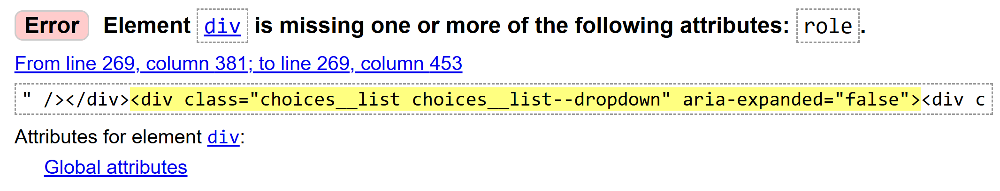

# Mobility Mapper Business Portal Testing

[Back to the README.md file](https://github.com/SonyaJane/mobility-mapper-business-portal#dmobility-mapper-business-portal)  

[Back to the Testing section in the README.md file](https://github.com/SonyaJane/mobility-mapper-portal#testing)

[View the live website here](https://mm-business-portal-deed0db15d35.herokuapp.com/)

## Table of Contents

- [Testing User Stories](#testing-user-stories)
- [Manual Testing](#manual-testing)
- [Automated Tests for the Accounts App](#automated-tests-for-the-accounts-app)
- [Code Validation](#code-validation)
- [Accessibility](#accessibility)
- [Tools Testing](#tools-testing)


## Testing User Stories

The following user stories outline the key functionalities and features of the Mobility Mapper Business Portal. Each story includes specific acceptance criteria to ensure that the implementation meets user needs and expectations.

1. **Create an account**  

    As a User I want to create an account so that I can access all portal features.  

    <br>

    **Acceptance Criteria**
    - The user can access a registration page from the landing page by clicking the "Get Started" button, or "Sign Up" in the navigation bar.
    - The registration form collects first name, last name, email (with confirmation), username, password (with confirmation), and allows the user to specify if they are a business owner and/or a wheeler.
    - The username field enforces uniqueness and allows only letters, numbers, underscores, and periods.
    - The form includes fields for country, county (if applicable), age group, and optional profile photo upload.
    - Password fields enforce strong password requirements and confirmation.
    - Helpful validation and error messages are shown inline for each field.
    - If the user already has an account, a clear link is provided to the sign-in page.
    - After submitting the form, users are prompted to verify their email address via a confirmation link that is emailed to them before logging in.
    - Upon successful registration, users are automatically logged in and directed to their personal dashboard.
<br>

2. **Edit my profile**  
   As a User, I want to be able to update my personal details, change my password, and manage my profile photo so that my account information is always current.

   <br>

    **Acceptance Criteria**
    - The user can access the Edit Profile page from their dashboard or navigation menu.
    - The Edit Profile form is pre-filled with the user's current information, including first name, last name, country, county (if applicable), age group, and profile photo.
    - The user can upload a new profile photo (PNG, JPEG, or WEBP, square, max 5MB), preview it before saving, or remove their existing photo.
    - The user can update their country, and if the UK is selected, the county field dynamically appears.
    - The user can indicate if they are a business owner and/or a wheeler; if "wheeler" is selected, a dynamic section appears for selecting one or more mobility devices, with an "Other" option for custom input.
    - All fields include validation and clear error messages.
    - The form uses CSRF protection and is fully accessible via keyboard and screen readers.
    - After saving changes, the user is redirected to their dashboard with a confirmation message.
    - The user can access a separate Change Password page from the Edit Profile or dashboard, where they can securely update their password with strong validation and receive feedback on success or errors.
    - All updates are immediately reflected in the user's profile and used throughout the portal (e.g., profile photo in navbar, updated details in verification reports).
<br>

3. **Contact support**  
   As a User, I want to contact the Mobility Mapper team for help, feedback, or suggestions, so that I can get assistance or share my ideas.
    <br>

    **Acceptance Criteria**
    - The user can access the contact/support form from the home page and from the navigation bar on any page.
    - The contact form includes fields for name, email address, and message.
    - The name field is pre-filled with the user's first and last name if they are logged in.
    - The email field is pre-filled with the user's registered email address if they are logged in
    - All fields include validation and clear error messages if required fields are missing or invalid.
    - The form uses CSRF protection and is fully accessible via keyboard and screen readers.
    - Upon successful submission, the user sees a confirmation message, and receives an email indicating their request has been received.
    - The support request is sent to the admin email address configured in the project settings.
    - The user can easily return to the previous page or dashboard after submitting the form.
<br>

4. **Register a business**  
As a Business Owner, I want to register my business so that it can be listed on the Mobility Mapper platform, found by wheelers, and managed through my dashboard.
    <br>

    **Acceptance Criteria**
    - The business owner can access the Register Business page from their dashboard or navigation menu.
    - The registration form collects all required business information, including:
      - Business name, address, contact details, website, and description.
      - The map allows the owner to set and preview the business location.
      - Selection of one or more business categories from a grouped multi-select dropdown.
      - Selection of accessibility features from a multi-select dropdown.
      - Opening hours, set using an interactive widget that allows multiple periods per day and easy copying between days.
      - Special offers for wheelers.
      - Choice of membership tier (Free, Standard, Premium) via visually distinct cards, each showing tier benefits and price.
    - Business categories and accessibility features are enhanced with Choices.js for multi-select, easy removal, and search, with clear placeholder text.
    - All form fields include validation and clear error messages.
    - The form uses CSRF protection and is fully accessible via keyboard and screen readers.
    - Guidance is provided on how to complete each section and why accurate information is important.
    - After successful submission, if the business owner selects a Free membership tier, they are redirected to their Business Dashboard, where they can manage their listing, request verification, and upgrade membership.  
    - If the business owner selects a paid membership tier (Standard or Premium), they are directed to the secure checkout page to complete payment before gaining full access to their Business Dashboard and premium features.
    - The new business appears in the accessible business search and on the map, with visibility and details determined by the selected membership
<br>

5. **View and manage dashboard and membership status**  
As a Business Owner, I want to access a dashboard showing my business details, membership status, payment history, and verification progress, so I can manage everything in one place.
    <br>

    **Acceptance Criteria**
    - The business owner can access their dashboard immediately after logging in or from the navigation menu at any time.
    - The dashboard displays:
    - Business details, including name, logo, address, categories, accessibility features, opening hours, and special offers.
    - A map showing the business location.
    - Current membership tier (Free, Standard, Premium), with a summary of benefits and renewal date.
    - Prominent buttons to view, upgrade, or renew membership.
    - Verification status, including the completed reports, and a "Verified by Wheelers" badge if achieved.
    - Links to view detailed verification reports.
    - Action buttons to edit or delete the business listing.
    - All information is presented in a clear, accessible, and responsive layout.
    - The dashboard updates in real time as business details, membership status, or verification progress change.
    - The business owner receives notifications (in-app or by email) for important actions, such as successful payments, verification status updates, and membership changes.
    - All actions are protected by authentication to ensure only the business owner can view and manage their own dashboard and membership.
<br>

6. **Manage business details**  
As a Business Owner, I want to add, edit, or remove my business details, including address, categories, accessibility features, opening hours, and special offers, so that my information is always accurate and up to date.

    <br>

    **Acceptance Criteria**
    - The business owner can access the Edit Business page from their dashboard.
    - All business fields are pre-filled with the current data, allowing for quick edits to name, address, contact details, website, description, and special offers.
    - The map allows the owner to update and preview the business location.
    - Business categories and accessibility features are enhanced with Choices.js for multi-select, easy removal, and search, with clear placeholder text.
    - Accessibility features can be updated at any time, with visually distinct badges shown for each selected feature.
    - The opening hours widget allows for intuitive editing of hours, including multiple periods per day and easy copying between days.
    - Textareas for description and services auto-resize as the user types for better usability.
    - All form fields include validation and clear error messages.
    - The form uses CSRF protection and is fully accessible via keyboard and screen readers.
    - The page provides guidance on how to complete each section and encourages accurate, complete information for better visibility.
    - After saving changes, the business owner is redirected to the Business Dashboard with a confirmation message.
    - The business owner can delete their business listing, with a confirmation prompt to prevent accidental deletion.
    - All updates are immediately reflected in the business search, map, and dashboard.
<br>

7. **Manage membership tier**  
As a Business Owner, I want to be able to view and upgrade my membership tier so I can unlock more features and increase my business’s visibility in search results.
    <br>

    **Acceptance Criteria**
    - The business owner can access the View Existing Membership and Upgrade Membership pages from their Business Dashboard.
    - The current membership tier (Free, Standard, or Premium) is clearly displayed, along with a summary of included benefits and the renewal date.
    - All available upgrade options are presented in visually distinct cards, each showing the tier name, benefits, and annual price.
    - The business owner can select a new tier to upgrade.
    - If an upgrade is selected, the user is directed to a secure Stripe-powered checkout page to complete payment.
    - Payment forms include inline validation, error handling, and a loading spinner during processing.
    - Upon successful payment, the membership tier is immediately updated and reflected in the Business Dashboard and business search results.
    - The business owner receives an email confirmation and receipt for the payment.
    - If the business owner cancels the upgrade process, no changes are made and they are returned to the dashboard.
    - All membership actions are protected by authentication to ensure only the business owner can manage their membership.
<br>

8. **Request accessibility verification**  
    As a Business Owner, I want to request independent verification of my business’s accessibility features by verified wheelers, so I can earn a "Verified by Wheelers" badge and attract more customers.
    <br>

    **Acceptance Criteria**
    - The business owner can access the Request Wheeler Verification page from their Business Dashboard.
    - The page clearly explains the verification process, including the number of required reports, the value of the badge, and the cost (if any) based on membership tier.
    - The page shows a preview of the "Verified by Wheelers" badge and describes its benefits.
    - The business owner submits a secure form (with CSRF protection) to request verification.
    - If payment is required, the user is directed to the secure checkout page after submitting the request.
    - The business owner receives an email notification confirming the request and any payment.
    - After payment (if necessary), the business’s listing in search results is updated to show that verification has been requested, and eligible wheelers can apply to verify from the business search listing.
    - The business owner can track the status of their verification request and view all submitted reports from their Business Dashboard.
    - The process and all interactive elements are fully accessible via keyboard and screen
<br>

9. **Track verification progress and reports**  
    As a Business Owner, I want to view the status of my verification request and access completed verification reports, so I can see detailed feedback.
    <br>

    **Acceptance Criteria**
    - The business owner can access verification status and reports from their Business Dashboard.
    - The business owener receives an email notification when a new verification report has been both submitted and approved.
    - The business owner can view each completed verification report in detail, including:
      - Confirmed and additional accessibility features.
      - Photos and evidence submitted by the wheeler.
      - The wheeler’s comments and feedback.
    - The dashboard updates automatically as reports are approved or statuses change.
    - If a business is fully verified (three independent reports approved), a "Verified by Wheelers" badge is displayed on the dashboard and business listing.
    - The business owner receives email notifications when their business achieves verified
    - All information is presented in a clear, accessible format, with responsive design for all devices.
<br>

10. **Make secure payments**  
    As a Business Owner, I want to pay for memberships or verification fees securely online using Stripe, and receive receipts and payment confirmations.
    <br>

    **Acceptance Criteria**
    - The business owner is directed to a secure checkout page when buying or upgrading to a paid membership tier, or requesting a paid verification.
    - The checkout page clearly displays the selected membership tier or verification request, and the price.
    - The payment form collects all required billing details and uses Stripe Elements for secure, PCI-compliant card entry.
    - All form fields include inline validation and clear error messages.
    - A loading spinner or overlay is shown during payment processing to prevent duplicate submissions.
    - Upon successful payment, the business owner is redirected to a payment success page with a summary of their purchase.
    - The business owner receives an automated email receipt and confirmation of their payment.
    - Payment status and membership/verification updates are immediately reflected in the Business Dashboard.
    - All payment actions are protected by authentication to ensure only the business owner can make payments for their own business.
    - Failed or cancelled payments display clear error messages and allow the user to retry or return to the dashboard without changes.
<br>

11. **Search for accessible businesses**  
    As a Wheeler, I want to search for accessible businesses using a search bar, filter by accessibility features, and restrict my search to a certain area on an interactive map, so I can find suitable venues in my area.
    <br>

    **Acceptance Criteria**
    - The user can access the Accessible Business Search page from the dashboard or navigation menu.
    - The search panel allows users to:
      - Enter free-text queries to find businesses by name, category, or tag.
      - Filter results by multiple accessibility features using a dynamic multi-select dropdown.
      - Instantly clear search terms or filters with dedicated buttons.
      - The interactive map (powered by MapLibre GL JS and Ordnance Survey tiles) allows users to pan and zoom to define their search area.
    - Search results are filtered based on the current map view: only businesses visible within the map’s bounds are shown in the results list.
    - Results are shown as a responsive list:
      - Each business displays its name, categories, address, accessibility features, and verification status.
      - Clicking a business expands an accordion with full details.
      - The visibility of certain details (e.g., contact info, website, special offers, logo) depends on the business’s membership tier.
      - The order of businesses is determined by membership tier (Premium first, then Standard, then Free), but results are randomised within each tier.
    - The map displays business locations as clickable markers.
    - Clicking a marker shows a popup with business details and a "Show more info" link on mobile, which shows detailed business info in a swipeable overlay.
    - Businesses requesting verification show a badge for wheelers to click to apply and earn a reward.
    - The interface is fully responsive:
      - On desktop, the map and results list are shown side-by-side.
      - On mobile, users can toggle between map view and list view.
    - Search results update in real time as users type (on desktop) or adjust filters, with a loading spinner for feedback.
    - All actions are accessible via keyboard and screen readers, with ARIA labels and semantic HTML.
    - Clear messages are shown if no results are found or if there is a problem with the search.
<br>

12. **Apply to verify accessible businesses**  
    As a Wheeler, I want to apply to verify businesses so I can contribute to the community and earn rewards.
    <br>

    **Acceptance Criteria**
    - The wheeler can find businesses requesting verification from the business search results.
    - Each business requesting verification is clearly marked with a call-to-action badge for wheelers.
    - The wheeler can view the accessibility features, address, and verification reward before applying.
    - The application process is initiated by clicking an "Apply to Verify" button, which opens a page.
    - Upon submitting the application, the wheeler receives a confirmation message and is redirected to the Accessibility Verification Hub.
    - The application status is updated in real time and visible in the hub (e.g., Pending, Approved, or Rejected).
    - The wheeler receives an email notification when their application is approved.
    - Only approved wheelers can access the verification form for the business.
    - All actions and forms are fully accessible via keyboard and screen readers, with appropriate ARIA labels and semantic HTML.
<br>

13. **Track and manage verification applications**  
    As a Wheeler, I want to view my verification applications, links to report forms and business details, and submitted reports in a dedicated hub, so I can plan my visits and manage my activity.
    <br>

    **Acceptance Criteria**
    - The wheeler can access the Accessibility Verification Hub from their personal dashboard or navigation menu.
    - The hub displays a table of all verification applications submitted by the user, including:
      - Business name (with a link to business details)
      - Application status (e.g., Pending, Approved, Rejected), shown with clear badges or labels
      - Date of application and, if approved, date of approval
      - Status of the verification report (Not Submitted, Submitted, Approved)
      - For each approved application, a prominent button or link is provided to access and complete the verification form for that business.
      - For pending applications, the user can see the current status and has the option to cancel the application if desired.
      - For submitted reports, the user can view their report and its approval status.
    - The interface is fully responsive and accessible, with keyboard navigation and screen reader support.
    - The hub updates in real time as application statuses change or reports are submitted.
    - The wheeler receives email notifications when their application or report is approved.
    - A clear message is displayed if the user has not made any verification applications yet.
<br>

14. **Submit on-site verification reports**  
    As a Wheeler, I want to submit detailed verification reports while visiting a business, including notes, accessibility feature confirmations, and photo evidence linked to specific features.
    <br>

    **Acceptance Criteria**
    - Only approved wheelers can access the Accessibility Verification Form for a business they have been assigned to verify.
    - The form displays the business name, address, and a summary of claimed accessibility features.
    - For each claimed feature, the wheeler can:
      - Confirm the feature is present by ticking a checkbox.
      - Upload a photo as evidence for each confirmed feature, with instant preview and the ability to remove or replace the photo.
    - The form includes a section for additional features not claimed by the business, allowing wheelers to confirm and upload photos for any extra features observed.
    - The wheeler must select the mobility device used during the visit.
    - The form requires a selfie at the business location for verification purposes (not shared publicly).
    - Additional photos can be uploaded for any other relevant evidence.
    - A comments section allows the wheeler to provide a brief written report about their experience and observations.
    - All fields include validation and clear error messages.
    - The form uses CSRF protection and is fully accessible via keyboard and screen readers.
    - Upon successful submission, the wheeler is redirected to a confirmation page.
    - The submitted report is visible in the Accessibility Verification Hub and to the business owner after admin approval.
    - The wheeler receives an email notification when their report is approved.
    - The wheeler receives a reward (e.g., a £10 Amazon voucher) for each completed and approved verification report.
<br>

## Manual Testing

* Browser Compatibility

Browser | Outcome | Pass/Fail  
--- | --- | ---
Google Chrome | No appearance, responsiveness nor functionality issues.| Pass
Mozilla Firefox | No appearance, responsiveness nor functionality issues. | Pass
Microsoft Edge | No appearance, responsiveness nor functionality issues. | Pass

* Device compatibility

Device | Outcome | Pass/Fail
--- | --- | ---
Lenovo Legion Slim 7 | No appearance, responsiveness nor functionality issues. | Pass
iPad Pro 11" | No appearance, responsiveness nor functionality issues. | Pass
Samsung Galaxy Ultra 22 | No appearance, responsiveness nor functionality issues. | Pass

* Elements Testing

**Common Elements**

Feature | Outcome | Pass/Fail
--- | --- | ---
Navigation Bar | Link is working as expected. | Pass
Menu | Links are working as expected. | Pass
Page title | Dynamically set and updates in browser tab and header | Pass
Bootstrap toasts | Multiple messages can be shown at once, each in its own alert box | Pass
Consistent branding | Mobility Mapper logo and color scheme are used throughout | Pass
Meta tags & favicons | Multiple favicon sizes and meta tags included for cross-device/browser compatibility | Pass
Central content container | Main content is centered and spaced consistently on all pages | Pass
Custom CSS/JS | Custom styles and scripts load correctly, with per-page additions supported | Pass
| Button hover effects | Changes colour on hover, cursor changes to pointer | Pass |
Logo | Logo is visible and links to the home/dashboard page | Pass
Responsive sidebar | Sidebar appears on large screens, collapses to hamburger menu on small screens | Pass
Hamburger menu | Appears on mobile, toggles navigation links as expected | Pass
Accessibility: Skip to content link | Present and works as expected for keyboard users | Pass
Accessibility: ARIA labels and roles | Present on navigation and interactive elements | Pass
Accessibility: Keyboard navigation | All interactive elements are accessible via keyboard | Pass
Accessibility: Color contrast | All text and UI elements meet WCAG AA contrast requirements | Pass
Logout button | Logs user out and redirects to home/login page | Pass


**Home**

| Feature | Outcome | Pass/Fail |
|---|---|---|
| Hero image | Visible at the top of the page | Pass |
| Welcome headline | "Welcome to the Mobility Mapper Business Portal" is displayed prominently | Pass |
| Motivational tagline | "Join us in making the UK more accessible—one business at a time." is visible | Pass |
| Call to action buttons (Not logged in) | "Get Started", "Sign In", and "Contact Us" buttons appear for unauthenticated users and work as expected | Pass |
| Call to action buttons (Logged in, wheelers) | "Personal Dashboard", "Search for Accessible Businesses", and "Contact Us" buttons appear and work as expected | Pass |
| Call to action buttons (Logged in, business users) | "Personal Dashboard", "Register Business" or "Business Dashboard", and "Contact Us" buttons appear and work as expected | Pass |
| Register Your Business card | Card is visible with title and description | Pass |
| Get Verified card | Card is visible with title and description | Pass |
| Search Accessible Places card | Card is visible with title and description | Pass |
| Testimonial blockquote | User testimonial is visible at the bottom of the page | Pass |


**Sign Up**

| Feature | Outcome | Pass/Fail |
|---|---|---|
| Registration form is visible | Form is centered in a card and clearly labeled "Sign Up" | Pass |
| Required fields validation | Submitting with missing required fields shows inline error messages or focuses in on the invalid field | Pass |
| First name field | First name field is present and required | Pass |
| Last name field | Last name field is present and required | Pass |
| Email confirmation field | Email confirmation field is present and must match email | Pass |
| Username field | Username field is present, required, and validated for uniqueness and greater than 5 characters | Pass |
| Business owner/wheeler options | User must select if they are a business owner and/or wheeler | Pass |
| Country and county fields | Country dropdown present and required; county field appears for UK | Pass |
| Age group selection | Age group dropdown is present and required | Pass |
| Profile photo upload | User can upload a profile photo; invalid files are rejected; file type and size restrictions are clearly communicated; image remains if errors occur elsewhere in form | Pass |
| Password confirmation field | Password confirmation field is present and must match password | Pass |
| Password strength validation | Weak passwords are rejected with a clear error message | Pass |
| CSRF protection | Form includes CSRF token | Pass |
| Account existence check | Attempting to register with an existing email results in an email saying an account already exists | Pass |
| Link to sign-in page | Clear link to sign-in page for existing users | Pass   |
| Email verification | User receives a verification email after registering | Pass |
| Successful registration redirect | User is redirected to signin page after successful registration, and a success message is displayed | Pass |

**Sign In**

| Feature | Outcome | Pass/Fail |
|---|---|---|
| Sign-in form is visible | Form is centered in a card and clearly labeled "Sign In" | Pass |
| Email/username field | Field is present and required | Pass |
| Password field | Field is present and required | Pass |
| Remember me checkbox | Checkbox is present and works as expected | Pass |
| CSRF protection | Form includes CSRF token | Pass |
| Forgot password link | Link to reset password page is present and works as expected | Pass |
| Link to sign-up page | Clear link to sign-up page for new users | Pass |
| Invalid credentials handling | Incorrect email/username or password shows a clear error message | Pass |
| Successful sign-in redirect | Wheelers are redirected to their personal dashboard after successful sign-in, and business owners are redirected to their business dashboard | Pass |

**Personal Dashboard**

| Feature                | Outcome                                                                                   | Pass/Fail |
|------------------------|------------------------------------------------------------------------------------------|-----------|
| Page heading           | "Personal Dashboard" heading is visible at the top of the page                           | Pass      |
| Profile photo          | Displays uploaded profile photo or placeholder if not set                                 | Pass      |
| User's name            | User's first and last name are displayed prominently                                     | Pass      |
| Username               | Username is shown in the profile details table                                           | Pass      |
| Email address          | Email is shown in the profile details table                                              | Pass      |
| Country, county, age   | Country, county, and age group are shown                                           | Pass      |
| Mobility devices       | Mobility devices device are shown if user is a wheeler                       | Pass      |
| Business link          | Business name is shown and links to Business Dashboard if user has a business            | Pass      |
| Edit Profile button    | Present and links to Edit Profile page                                                   | Pass      |
| Change Password button | Present and links to Change Password page                                                | Pass      |
| Register Business      | Button appears if user is a business owner but has not registered a business             | Pass      |
| Accessibility Hub      | Button appears if user is a wheeler or has verification activity                         | Pass      |
| Approved verifications | List of businesses user is approved to verify, with Start Verification and View buttons  | Pass      |
| Pending applications   | List of businesses user has applied to verify, with Cancel and View buttons              | Pass      |
| Verification info      | Card explains verification process and links to Accessible Business Search                | Pass      |
| Responsive layout      | All cards, tables, and content adapt correctly to all screen sizes                       | Pass      |
| Flash messages         | Success/error/info messages display at the top and are dismissible                       | Pass      |


**Edit Profile**

| Feature                    | Outcome                                                                                         | Pass/Fail |
|----------------------------|------------------------------------------------------------------------------------------------|-----------|
| Page heading               | "Edit Profile" heading is visible at the top of the page                                       | Pass      |
| Form pre-filled            | All fields are pre-filled with the user's current information                                  | Pass      |
| First/last name fields     | Present, required, and editable                                                                | Pass      |
| Email field                | Present, required, and editable                                                                | Pass      |
| Country and county fields  | Country dropdown present; county field appears for UK and is required                          | Pass      |
| Age group field            | Dropdown present and required                                                                  | Pass      |
| Profile photo section      | Current photo is shown if present                                                              | Pass      |
| Profile photo upload       | User can upload or remove a profile photo; invalid files are rejected                | Pass      |
| Remove photo option        | Checkbox to remove current photo is present and works                                          | Pass      |
| Business owner/wheeler     | User can update business owner and wheeler status; mobility device type field appears and disappears as appropriate; required if wheeler button is selected | Pass |
| Mobility devices           | Multi-select for mobility devices appears if wheeler is selected; "Other" input works and is pre-filled with existing data | Pass      |
| CSRF protection            | Form includes CSRF token                                                                       | Pass      |
| Save Changes button        | Present, submits the form, and updates the profile                                             | Pass      |
| Cancel button              | Present, returns user to dashboard without saving                                              | Pass      |
| Success feedback           | Confirmation message is shown after saving changes                                             | Pass      |
| Error summary              | Validation errors are shown at the top of the form if present                                  | Pass      |
| Responsive layout          | Form and content adapt correctly to all screen sizes                                           | Pass      |


**Business Registration**

| Feature | Outcome | Pass/Fail |
|---|---|---|
| Page heading | "Register Your Accessible Business" heading is visible at the top | Pass |
| Introductory text | Explains the importance of complete listings and public visibility | Pass |
| Verified by Wheelers badge preview | Badge is shown with icon and label | Pass |
| Business name and address fields | Present, required, and validated | Pass |
| Public and contact phone fields | Present and validated | Pass |
| Website and public email fields | Present and validated | Pass |
| Social media links fields | Present and validated | Pass |
| Description and services fields | Present | Pass |
| Logo upload | Allows PNG, JPEG, or WEBP, square, max 5MB; file input is present and works | Pass |
| Location map | Interactive map allows setting and previewing business location | Pass |
| Categories multi-select | Grouped dropdown, allows multiple selections, enhanced with Choices.js | Pass |
| Accessibility features multi-select | Dropdown allows multiple selections, enhanced with Choices.js | Pass |
| Opening hours widget | Table allows setting multiple periods per day, copy to next day, and dynamic updates | Pass |
| Membership tier selection | Cards for Free, Standard, Premium; only one can be selected; keyboard accessible | Pass |
| Tier benefits and price | Each card displays tier name, benefits, and price | Pass |
| Selected tier is highlighted | Selected card is visually distinct (border and shadow) | Pass |
| Register button | Present, submits the form | Pass |
| After submission (Free tier) | Redirects to Business Dashboard with confirmation | Pass |
| After submission (Paid tier) | Redirects to secure checkout page | Pass |
| CSRF token | Present in the form for security | Pass |
| JavaScript enhancements | Opening hours and membership tier selection work as expected | Pass |


**Business Dashboard**

| Feature | Outcome | Pass/Fail |
|---|---|---|
| Business logo | Displays uploaded logo or placeholder if not set | Pass |
| Business name and dashboard label | Business name and "Dashboard" label shown prominently | Pass |
| Owner's name | Owner's first and last name displayed in details table | Pass |
| Categories | All assigned categories listed; prompt and link to add if none | Pass |
| Address | Full address shown; prompt and link to add if missing | Pass |
| Website | Website link shown and opens in new tab; prompt and link to add if missing | Pass |
| Public email | Email shown as mailto link; prompt and link to add if missing | Pass |
| Public phone | Phone number shown; prompt and link to add if missing | Pass |
| Private phone | Private phone shown; prompt and link to add if missing | Pass |
| Social media links | Facebook, Twitter/X, Instagram icons shown if set; prompt and link to add if none | Pass |
| Location map | Interactive map displays business location with marker | Pass |
| Description and Services | Description shown; prompt and link to add if missing | Pass |
| Services offered | Services listed; prompt and link to add if missing | Pass |
| Special offers | Special offers shown; prompt and link to add if missing | Pass |
| Accessibility features | All features shown as badges | Pass |
| Opening hours | Table displays hours for each day the business is open; prompt and link to add if missing | Pass |
| Membership tier | Current tier (Free, Standard, Premium) shown with tailored message and 'Explore Plans' and 'View Current Membership' buttons; buttons function as expected | Pass |
| Verification status | Shows "Verified by Wheelers" badge, "Verification requested", or button to request verification | Pass |
| Verification reports | List of completed reports with links to view each; message if none yet | Pass |
| Edit Business button | Present and links to edit page | Pass |
| Delete Business button | Present and opens 'are you sure' modal | Pass |
| No business registered state | Message and "Register Now" button shown if user has no business | Pass |
| Flash messages | Success/error/info messages display at the top of the page and are dismissible | Pass |
| Dynamic content | All prompts, links, and actions update based on business data and membership tier | Pass |


**Edit Business**

| Feature | Outcome | Pass/Fail |
|---|---|---|
| Page heading | "Edit your business" heading is visible at the top | Pass |
| Introductory text | Explains public visibility and importance of complete listings | Pass |
| Business logo preview | Current logo is displayed if set | Pass |
| Delete logo option | Checkbox to delete current logo without replacing is present and works | Pass |
| Change logo | Allows PNG, JPEG, or WEBP, square, max 5MB; file input is present and works | Pass |
| Error message shown if user tried to both delete logo and upload new one | Pass |
| All fields pre-filled | All business fields are pre-filled with current data for editing | Pass |
| Business name and address fields | Present, required, and validated | Pass |
| Public and contact phone fields | Present and validated | Pass |
| Website and public email fields | Present and validated | Pass |
| Social media links fields | Present and validated | Pass |
| Description and services fields | Present | Pass |
| Location map | Interactive map allows setting and previewing business location | Pass |
| Categories multi-select | Grouped dropdown, allows multiple selections, enhanced with Choices.js | Pass |
| Accessibility features multi-select | Dropdown allows multiple selections, enhanced with Choices.js | Pass |
| Opening hours widget | Table allows setting multiple periods per day, copy to next day, and dynamic updates | Pass |
| Save Changes button | Present, submits the form | Pass |
| Cancel button | Present, returns user to dashboard without saving | Pass |
| Delete Business button | Opens confirmation modal; modal contains cancel and confirm delete actions | Pass |
| JavaScript enhancements | Opening hours, and category selection work as expected | Pass |
| After submission | Redirects to Business Dashboard with confirmation message | Pass |
| Error summary | Validation errors are shown at the top of the form | Pass |
| CSRF token | Present in the form for security | Pass |


**View Existing Membership**

| Feature | Outcome | Pass/Fail |
|---|---|---|
| Page heading | "Your Current Membership" heading is visible at the top | Pass |
| Membership tier | Current membership tier (Free, Standard, or Premium) is displayed clearly | Pass |
| Start date | Membership start date is shown in a readable format | Pass |
| End date | Membership end date is shown in a readable format | Pass |
| Benefits list | All benefits for the current tier are listed as bullet points | Pass |
| Upgrade Membership button | Prominent button is present and links to the Upgrade Membership page | Pass |
| Responsive layout | Page and content adapt correctly to all screen sizes | Pass |


**Upgrade Membership**

| Feature | Outcome | Pass/Fail |
|---|---|---|
| Page heading | "Membership Options" heading is visible at the top | Pass |
| Current membership tier | User's current tier (Free, Standard, or Premium) is displayed with a summary of included benefits | Pass |
| Benefits list | All benefits for the current tier are listed as bullet points | Pass |
| Upgrade options section | All available upgrade tiers are displayed in visually distinct cards | Pass |
| Tier name | Each upgrade card shows the tier name (e.g., Standard, Premium) | Pass |
| Tier benefits | Each upgrade card lists all benefits for that tier | Pass |
| Tier price | Each upgrade card displays the annual price clearly | Pass |
| Upgrade button | Each card has a prominent "Upgrade to [Tier]" button that links to the Stripe-powered checkout for the selected tier | Pass |
| Multiple upgrade options message | If more than one upgrade is available, a message indicates this | Pass |
| Return to Business Dashboard button | Present and returns user to the dashboard without making changes | Pass |
| Responsive layout | Page and cards adapt correctly to all screen sizes | Pass |


**Accessible Business Search**

| Feature | Outcome | Pass/Fail |
|---|---|---|
| Text search input | Present, with placeholder "Find accessible businesses", allows searching by business name, category, location, or tags (see Category model, tags attribute) | Pass |
| Filter by map | Zooming or panning the map updates the results list to only show businesses within the current map bounds | Pass |
| Page loads with all businesses | On initial load, all businesses are shown in the results list and on the map. In the list, businesses are sorted by tier (Premium, Standard, Free), but randomised within each tier | Pass |
| Automatic search (desktop) | Search runs automatically as user types on desktop screens | Pass |
| Search button (mobile) | Present on mobile screens only, runs search on click or enter | Pass |
| Clear search button | Present, clears the search input and resets results | Pass |
| Accessibility features filter | Multi-select dropdown lists all features; users can select multiple features; can search for features by name by typing in the input field | Pass |
| Clear features button | Present when features filter is applied, clears all selected accessibility features | Pass |
| Clear individual feature | Each selected feature has a small "x" to remove it from the filter | Pass |
| Results list | Responsive list displays businesses matching search and filters | Pass |
| Loading spinner | Spinner appears during search/filter operations | Pass |
| No results message | Clear message shown if no businesses match the search/filter criteria | Pass |
| Business details in list | Each result shows name, categories, address, accessibility badges, and verification status (no badge is shown if not verified, nor requested verification) | Pass |
| Membership tier ordering | Results are ordered by membership tier (Premium, Standard, Free), randomised within each tier | Pass |
| Accordion for details | Clicking a business expands accordion with full details (features, website, contact, description, services, offers, hours) | Pass |
| Membership dependent details | Social media links, email address, business logo, description, special offers are shown based on business membership tier (standard and premium shows all, free hides) | Pass |
| Verification badge | Businesses requesting verification show a badge that can be clicked by wheelers | Pass |
| Map display | Interactive map (MapLibre GL JS) shows business locations as markers; shown on left of results list on desktop, can be toggled on mobile | Pass |
| Map markers | Clicking a marker shows a popup with business details, and on mobile screens "Show more info" link; turns orange when the accordion is open on desktop screens | Pass |
| Info overlay (mobile) | Detailed business info appears in overlay when "Show more info" link is clicked | Pass |
| Show list view button (mobile) | Present, toggles to results list on mobile | Pass |
| Show map view button (mobile) | Present, toggles back to map view on mobile | Pass |


**Request Wheeler Verification**

| Feature | Outcome | Pass/Fail |
|---|---|---|
| Page heading | "Wheeler Verification" heading is visible at the top | Pass |
| What is Wheeler Verification section | Explains the process and requirements for verification | Pass |
| Cost transparency | Clearly displays the cost of the verification request based on membership tier (free for Premium, price shown for others) | Pass |
| Badge preview | "Verified by Wheelers" badge is shown with icon and label | Pass |
| Badge value explanation | Explains the value of the badge for building trust with customers | Pass |
| How it works section | Describes the verification workflow and tracking from the Business Dashboard | Pass |
| In-progress badge preview | Shows the badge that appears in search results while verification is pending | Pass |
| Reward explanation | Explains the reward for wheelers (£10 Amazon voucher) | Pass |
| Application process explanation | Explains that only verified wheelers can apply and all reports are checked for accuracy | Pass |
| Request Verification button | Prominent button submits the verification request | Pass |
| Return to Dashboard button | Present, and returns user to the Business Dashboard without requesting verification | Pass |
| Success/error feedback | Confirmation or error messages are displayed after submission | Pass |
| Responsive layout | Page and all sections adapt correctly to all screen sizes | Pass |

**Accessibility Verification Application**

| Feature | Outcome | Pass/Fail |
|---|---|---|
| Page heading | "Accessibility Verification" heading is visible at the top | Pass |
| Business name and address | Business name and full address are shown on the first two lines | Pass |
| Accessibility features badges | All features specified by the business are listed as visually distinct badges | Pass |
| Badge preview | "Verified by Wheelers" badge is shown with icon and label | Pass |
| Verification process explanation | Explains that three independent verifications are required for the badge | Pass |
| Badge value explanation | Describes the value of the badge for customers in search results | Pass |
| Wheeler responsibilities list | Clearly lists all requirements for wheelers (visit, photos, report, selfie) | Pass |
| Reward explanation | States the reward (e.g., £10 Amazon voucher) for each completed and approved verification | Pass |
| Confirm Application button | Prominent button submits the application | Pass |
| Cancel button | Present, returns user to the business search page | Pass |
| After submission | Redirected to the Application Submitted page | Pass |
| Responsive layout | Page and all sections adapt correctly to all screen sizes | Pass |


**Accessibility Verification Application Submitted**

| Feature | Outcome | Pass/Fail |
|---|---|---|
| Page heading | "Application Submitted" heading is visible at the top | Pass |
| Confirmation message | Clearly states the business name for which the application was submitted | Pass |
| Admin review notice | Informs the user that an admin will review their application as soon as possible | Pass |
| Next steps list | Explains that, upon approval, the user will receive an email, see a link to the verification form in their Accessibility Verification Hub and dashboard/profile, and can then complete and submit their verification report | Pass |
| Accessibility Verification Hub button | Prominent button links to the Accessibility Verification Hub | Pass |
| Success/error messages | Any feedback messages are displayed at the top of the page | Pass |
| Responsive layout | Page and all sections adapt correctly to all screen sizes | Pass |


**Accessibility Verification Hub**

| Feature | Outcome | Pass/Fail |
|---|---|---|
| Page heading | "Accessibility Verification Hub" heading is visible at the top | Pass |
| Introductory text | Welcome message explains the purpose of the hub | Pass |
| Verification requests table | Table lists all verification requests made by the user | Pass |
| Business name column | Each row shows the business name with a direct link to business details | Pass |
| Request status column | Status (Submitted, Approved) is shown with colored badges | Pass |
| Date requested column | Date the request was made is displayed in readable format | Pass |
| Date approved column | Date of approval is shown, or "Waiting for approval" if not yet approved | Pass |
| Verification report status column | Status (Not Submitted, Submitted, Approved) is shown with badges | Pass |
| Actions column | Context-sensitive buttons: "Submit Verification", "View Report", or "Cancel Request" | Pass |
| Cancel request modal | Modal confirmation appears when cancelling a request | Pass |
| No requests state | Message is shown if the user has not made any verification requests; button to find businesses to verify via the search page is present | Pass |
| Table responsiveness | Table is scrollable and responsive on all screen sizes | Pass |


**Accessibility Verification Form**

| Feature | Outcome | Pass/Fail |
|---|---|---|
| Page heading | "Accessibility Verification" heading is visible at the top | Pass |
| Business name and address | Business name and full address are displayed for reference | Pass |
| Anonymity notice | Message clarifies responses are anonymous and not shared with the business | Pass |
| Confirmed features section | Lists all claimed accessibility features; each can be ticked to confirm and has a photo upload button | Pass |
| Feature photo upload | For each confirmed feature, user must upload a photo; can see instant preview; can remove/replace it | Pass |
| Additional features section | Lists other possible features; user can tick and upload photos for any observed | Pass |
| Additional feature photo upload | For each additional feature, user must upload a photo, see preview, and remove/replace it | Pass |
| Mobility device selection | User must select which mobility device was used during the visit | Pass |
| Selfie upload | User must upload a photo of themselves at the business location (required) | Pass |
| Additional photos upload | User can upload multiple extra photos not already linked to features | Pass |
| Comments section | Textarea for user to write a brief report about their accessibility experience | Pass |
| Inline validation | Errors are shown next to fields or in a prominent alert area if required fields are missing | Pass |
| Server-side error summary | Validation errors are shown at the top of the form | Pass |
| CSRF token | Present in the form for security | Pass |
| Submit button | Clearly labeled, submits the form, and shows loading state | Pass |
| Success feedback | User is redirected to their dashboard after successful submission, and a success message toast is displayed | Pass |
| Email confirmation | User receives an email confirming receipt of their verification report | Pass |
| JavaScript enhancements | Dynamic photo previews, removal, and validation work as expected | Pass |

**Accessibility Verification Approval**

| Feature | Outcome | Pass/Fail |
|---|---|---|
| Email notification (Wheeler) | Wheeler receives an email when their verification report has been approved | Pass |
| Email notification (Business) | Business owner receives an email when their business has been verified by a wheeler | Pass |
| Business Dashboard update | Business dashboard shows updated verification status and badge if applicable | Pass |
| Accessible Search Results listing | Shows verified badge in search results | Pass |

**Accessibility Verification Report**

| Feature | Outcome | Pass/Fail |
|---|---|---|
| Page heading | "Verification of the accessibility features of <Business Name>" heading is visible at the top | Pass |
| Wheeler name | Only visible to the wheeler | Pass |
| Address visited | Full business address is shown in a dedicated card | Pass |
| Date of verification | Date is displayed in a readable format | Pass |
| Mobility device used | Device used during the visit is shown | Pass |
| Accessibility features confirmed | List of all features confirmed by the wheeler is shown | Pass |
| Additional features found | List of any extra features observed and reported is shown | Pass |
| Feature photos carousel | Carousel displays all photos linked to specific features, each labeled with the feature name | Pass |
| Other photos carousel | Carousel displays any additional photos submitted, with navigation controls | Pass |
| No photos fallback | Message shown if no photos were submitted in a section | Pass |
| Wheelers comments | Written comments and observations are displayed in a styled container | Pass |
| Responsive layout | All cards, carousels, and content adapt correctly to all screen sizes | Pass |
| Alt text for images | All images include descriptive alt text for screen readers | Pass |

**Business Details**

| Feature | Outcome | Pass/Fail |
|---|---|---|
| Page visibility | Page is accessible only to wheelers confirming accessibility of a business | Pass |
| Link to page | Link to the page is available in the verification request table in the Accessibility Verification Hub, and on the Wheeler's dashboard (prior to verification) | Pass |
| Page heading | "Business Details" heading is visible at the top | Pass |
| Business logo | Logo is displayed if set; placeholder if not | Pass |
| Business name | Business name is shown prominently in the header | Pass |
| Categories | All assigned categories are listed | Pass |
| Address | Full address is shown | Pass |
| Website | Website link is shown and opens in a new tab if set | Pass |
| Public email | Email is shown as a mailto link if set | Pass |
| Public phone | Phone number is shown as a tel link if set | Pass |
| Social media links | Facebook, Twitter/X, Instagram icons shown if set; open in new tab | Pass |
| Location map | Interactive map displays business location | Pass |
| Description | Description is shown if set | Pass |
| Services offered | Services are listed if set | Pass |
| Special offers | Special offers are shown if set | Pass |
| Verification status | Shows "Verified by Wheelers" badge, "Verification requested", or "Please verify the accessibility of this business" based on status | Pass |
| Accessibility features | All features are shown as badges | Pass |
| Opening hours | Table displays hours for each day they are open | Pass |
| Responsive layout | All cards, tables, and content adapt correctly to all screen sizes | Pass |


**Checkout**

| Feature | Outcome | Pass/Fail |
|---|---|---|
| Page heading | "Checkout" heading is visible at the top | Pass |
| Purchase summary | Clearly displays whether the user is purchasing a membership tier or requesting wheeler verification | Pass |
| Membership tier display | For membership purchases, selected membership tier and its benefits are shown; user can change tier before payment | Pass |
| Verification purchase display | If purchasing verification, shows cost and summary | Pass |
| Amount display | Amount to be charged is clearly shown and updates if tier is changed | Pass |
| Contact details card | Collects full name, email, and phone number; all fields required and validated | Pass |
| Billing address card | Collects street address, city, county, and postcode; all fields required and validated | Pass |
| Payment details card | Stripe Elements card input is present, secure, and validated in real time | Pass |
| Charge warning | Clearly states the exact amount to be charged above the Complete Payment button | Pass |
| Submit button | Labeled "Complete Payment" or "Request Verification" as appropriate; submits the form | Pass |
| Cancel button | Opens confirmation modal to cancel checkout and return to dashboard | Pass |
| Loading overlay | Spinner appears during payment processing to prevent duplicate submissions | Pass |
| Error handling | Inline validation errors for each field; Stripe errors shown above payment form | Pass |
| Success feedback | On successful payment, user is redirected to a confirmation page and receives an email receipt | Pass |

**Payment Success**

| Feature | Outcome | Pass/Fail |
|---|---|---|
| Page heading | "Payment Successful" heading is visible at the top | Pass |
| Confirmation message | Thanks the user for their payment and informs them a confirmation email will be sent to their provided email address | Pass |
| Purchase and Billing information card | Card displays all relevant purchase details | Pass |
| Purchase type | Shows whether the payment was for a Membership Upgrade or Verification Request, and the specific membership tier if applicable | Pass |
| Purchase amount | Amount paid is displayed in GBP | Pass |
| Reference number | Unique transaction reference number is shown | Pass |
| Purchase date | Date of payment is displayed in a readable format | Pass |
| Full name | Name used for the purchase is shown | Pass |
| Email address | Email used for the purchase is shown | Pass |
| Phone number | Phone number used for the purchase is shown | Pass |
| Billing address | Full billing address (street, city, county, postcode) is displayed | Pass |
| Go to Business Dashboard button | Prominent button returns user to the Business Dashboard | Pass |
| Responsive layout | Page and all sections adapt correctly to all screen sizes | Pass |


**Contact**

| Feature | Outcome | Pass/Fail |
|---|---|---|
| Page heading | "Contact Us" heading is visible at the top | Pass |
| Introductory text | Explains how to get in touch and what the form is for | Pass |
| Name field | Prefilled for logged-in users, required, and validated | Pass |
| Email field | Prefilled for logged-in users, Present, required, validated, and must be a valid email address | Pass |
| Message field | Present, required, and validated | Pass |
| CSRF token | Present in the form for security | Pass |
| Inline validation | Errors are shown next to fields if invalid or missing | Pass |
| Send button | Clearly labeled, submits the form, and shows loading state | Pass |
| Success feedback | Confirmation message is shown after successful submission | Pass |
| Email delivery | Form submission sends an email to the admin address configured in settings | Pass |
| Responsive layout | Form and container display correctly on all screen sizes | Pass |

**Error Handling**

| Feature | Outcome | Pass/Fail |
|---|---|---|
| Custom 404 error page | Displays "404 - Page Not Found" heading and clear message | Pass |
| Guidance text | Explains the page may have been removed, renamed, or is temporarily unavailable | Pass |
| Return to Dashboard button | Prominent button returns user to their dashboard | Pass |
| Consistent branding | Page uses site logo, color scheme, and layout consistent with the rest of the portal | Pass |
| Responsive layout | Error page adapts correctly to all screen sizes | Pass |
| Error messages in forms | All forms throughout the portal display clear, specific error messages for validation and server errors | Pass |
| Inline validation | Form fields with errors are highlighted and show messages next to the relevant field | Pass |
| Feedback messages | Success, error, and info messages are displayed as Bootstrap toasts or alerts and are dismissible | Pass |


## Automated Tests for the Accounts App

`accounts/tests.py` implements a comprehensive suite of automated tests to ensure the reliability, correctness, and security of the accounts app. 

To run the tests, use the following command:

```bash
pytest accounts/tests.py
```

These tests cover the following key areas:

### Test Coverage Table

| Area / Feature                        | Test Description                                                                                   | Test Class / Method(s)                              |
|---------------------------------------|---------------------------------------------------------------------------------------------------|-----------------------------------------------------|
| **Dashboard View**                    | Dashboard view access, template rendering, and content                                            | `DashboardViewTests`                                |
|                                       | Authenticated user can access dashboard                                                           | `DashboardViewTests.test_account_dashboard_view_authenticated` |
|                                       | Unauthenticated user is redirected from dashboard                                                 | `DashboardViewTests.test_account_dashboard_view_unauthenticated` |
|                                       | Unauthenticated users redirected to login with next param                                         | `DashboardViewTests.test_account_dashboard_view_unauthenticated_redirect_url` |
|                                       | Unauthenticated users are redirected from dashboard                                               | `DashboardViewTests.test_dashboard_redirects_unauthenticated` |
|                                       | Correct template is used for dashboard                                                            | `DashboardViewTests.test_dashboard_template_used`    |
|                                       | Dashboard displays all profile fields rendered in template                                        | `DashboardViewTests.test_dashboard_renders_profile_fields` |
|                                       | Dashboard shows placeholder image if no profile photo                                             | `DashboardViewTests.test_dashboard_profile_photo_placeholder` |
|                                       | Wheeler-specific sections rendered if user is_wheeler                                             | `DashboardViewTests.test_dashboard_wheeler_section_shown` |
|                                       | Wheeler-specific sections not rendered if user is not a wheeler                                   | `DashboardViewTests.test_dashboard_wheeler_section_hidden_for_non_wheeler` |
|                                       | Dashboard displays mobility_devices_other if set                                                  | `DashboardViewTests.test_dashboard_displays_mobility_devices_other` |
|                                       | Dashboard handles missing profile gracefully                                                      | `DashboardViewTests.test_dashboard_handles_missing_profile` |
| **Edit Profile View**                 | Edit profile view access, form submission, permissions, and field logic                           | `EditProfileViewTests`                              |
|                                       | Authenticated user can access edit profile page                                                   | `EditProfileViewTests.test_edit_profile_view_authenticated` |
|                                       | Unauthenticated user is redirected from edit profile page                                         | `EditProfileViewTests.test_edit_profile_view_unauthenticated` |
|                                       | Edit profile template contains expected fields, buttons, and JS                                   | `EditProfileViewTests.test_edit_profile_template_content` |
|                                       | Another user cannot edit this user's profile                                                      | `EditProfileViewTests.test_edit_profile_permission`  |
|                                       | Submitting valid edit profile form updates user and redirects                                     | `EditProfileViewTests.test_edit_profile_post_valid`  |
|                                       | Submitting invalid data does not update and shows errors                                          | `EditProfileViewTests.test_edit_profile_post_invalid` |
|                                       | Selecting multiple mobility devices works                                                         | `EditProfileViewTests.test_edit_profile_post_multiple_mobility_devices` |
|                                       | Submitting form with no changes does not alter profile                                            | `EditProfileViewTests.test_edit_profile_no_changes`  |
|                                       | Submitting form with only optional fields changed works                                           | `EditProfileViewTests.test_edit_profile_optional_fields` |
|                                       | Submitting form with invalid foreign keys returns validation error                                | `EditProfileViewTests.test_edit_profile_invalid_foreign_keys` |
|                                       | Removing a profile photo via the form works                                                       | `EditProfileViewTests.test_edit_profile_remove_photo` |
|                                       | Uploading a valid profile photo works                                                             | `EditProfileViewTests.test_edit_profile_photo_upload` |
|                                       | Uploading an invalid photo file type shows error                                                  | `EditProfileViewTests.test_edit_profile_invalid_photo_upload` |
|                                       | Uploading a non-image file as photo returns validation error                                      | `EditProfileViewTests.test_edit_profile_invalid_image_extension` |
|                                       | Omitting required field (country) returns validation error                                        | `EditProfileViewTests.test_edit_profile_missing_required_field` |
|                                       | Changing only one field updates only that field                                                   | `EditProfileViewTests.test_edit_profile_change_single_field` |
|                                       | Clearing all optional fields removes them from profile                                            | `EditProfileViewTests.test_edit_profile_remove_all_optional_fields` |
|                                       | Toggling is_wheeler checkbox on and off                                                          | `EditProfileViewTests.test_edit_profile_set_and_unset_is_wheeler` |
|                                       | Toggling has_business checkbox on and off                                                         | `EditProfileViewTests.test_edit_profile_set_and_unset_has_business` |
| **Profile Photo**                     | Profile photo display, upload, removal, and validation                                            | `ProfilePhotoTests`                                  |
|                                       | Dashboard displays uploaded profile photo, not placeholder                                        | `ProfilePhotoTests.test_dashboard_displays_actual_profile_photo` |
|                                       | Uploading a valid profile photo works                                                             | `ProfilePhotoTests.test_edit_profile_photo_upload`    |
|                                       | Removing a profile photo clears the photo                                                         | `ProfilePhotoTests.test_edit_profile_remove_photo`    |
|                                       | Uploading an invalid photo file type shows error                                                  | `ProfilePhotoTests.test_edit_profile_invalid_photo_upload` |
|                                       | Remove and upload new photo sequence works                                                        | `ProfilePhotoTests.test_delete_and_upload_new_photo`  |
|                                       | Uploading too large or invalid photo returns correct error                                        | `ProfilePhotoTests.test_upload_too_large_or_invalid_photo` |
| **UserProfileForm**                   | UserProfileForm validation                                                                        | `UserProfileFormTests`                               |
|                                       | Form is valid with correct data                                                                   | `UserProfileFormTests.test_valid_form`               |
|                                       | Form is invalid if required fields are missing                                                    | `UserProfileFormTests.test_invalid_form_missing_required` |
|                                       | Edge cases: invalid types, blank/extra fields, all fields blank, optional fields                  | `UserProfileFormTests.test_form_edge_cases`          |
|                                       | Handles mobility_devices_other field                                                              | `UserProfileFormTests.test_other_device`             |
| **CustomSignupForm**                  | CustomSignupForm validation                                                                       | `CustomSignupFormTests`                              |
|                                       | Signup form is valid with correct data                                                            | `CustomSignupFormTests.test_signup_form_valid`       |
|                                       | Password mismatch returns error                                                                   | `CustomSignupFormTests.test_signup_form_password_mismatch` |
|                                       | Email mismatch returns error                                                                      | `CustomSignupFormTests.test_signup_form_email_mismatch` |
|                                       | Duplicate username returns error                                                                  | `CustomSignupFormTests.test_signup_form_duplicate_username` |
|                                       | Signup with profile photo works                                                                   | `CustomSignupFormTests.test_signup_form_with_profile_photo` |
|                                       | Required fields present/missing validation                                                        | `CustomSignupFormTests.test_signup_form_required_fields` |
|                                       | Business fields and missing business fields validation                                            | `CustomSignupFormTests.test_signup_form_business_fields` |
| **UserProfile Signals**               | UserProfile creation signal                                                                       | `UserProfileSignalTests`                             |
|                                       | Profile auto-created on user creation                                                             | `UserProfileSignalTests.test_userprofile_created_on_user_creation` |
|                                       | Profile deleted on user deletion                                                                  | `UserProfileSignalTests.test_userprofile_deleted_on_user_deletion` |
|                                       | Profile not created twice                                                                         | `UserProfileSignalTests.test_userprofile_not_created_twice` |
| **Context Processor**                 | user_profile context processor                                                                    | `UserProfileContextProcessorTests`                   |
|                                       | Adds user_profile for authenticated users                                                         | `UserProfileContextProcessorTests.test_user_profile_injected_for_authenticated` |
|                                       | Does not add user_profile for anonymous users                                                     | `UserProfileContextProcessorTests.test_user_profile_not_injected_for_anonymous` |
| **UserProfile Model Methods**         | UserProfile model methods and related functionality                                               | `UserProfileModelMethodTests`                        |
|                                       | Profile fields can be set and retrieved                                                           | `UserProfileModelMethodTests.test_profile_fields`    |
|                                       | Mobility devices many-to-many relationship                                                        | `UserProfileModelMethodTests.test_mobility_devices_many_to_many` |
|                                       | get_full_name method returns correct full name                                                    | `UserProfileModelMethodTests.test_get_full_name`     |
|                                       | is_business_owner property/method                                                                 | `UserProfileModelMethodTests.test_is_business_owner` |
|                                       | String representation (__str__) returns username                                                  | `UserProfileModelMethodTests.test_userprofile_str`   |
| **Template Tags**                     | Custom template tags in account_extras.py                                                         | `TemplateTagTest`                                    |
|                                       | device_labels filter returns comma-separated string of device names                                | `TemplateTagTest.test_device_labels_filter`          |
|                                       | dict_get filter retrieves correct value from dictionary                                            | `TemplateTagTest.test_dict_get_filter`               |
|                                       | filter_unverified filter returns only unverified businesses                                       | `TemplateTagTest.test_filter_unverified_filter`      |
| **AJAX Username Validation**          | validate_username view (AJAX username availability check)                                         | `ValidateUsernameViewTests`                          |
|                                       | New username is reported as available                                                             | `ValidateUsernameViewTests.test_username_available`  |
|                                       | Existing username is reported as taken                                                            | `ValidateUsernameViewTests.test_username_taken`      |
|                                       | Blank username is reported as not taken (or as invalid)                                           | `ValidateUsernameViewTests.test_username_blank`      |


## Code Validation

### HTML

The [W3C Markup Validator](https://validator.w3.org/) was used to validate the project HTML code to ensure there were no syntax errors.
 
W3C Markup Validator found the following errors for the business search page:



This error is caused by the third-party JavaScript library Choices.js, which dynamically generates dropdowns and lists using <div> elements, but does not add the appropriate ARIA role attributes for accessibility.


This error was solved by changing the id to a class, as the copening hours table is being rendered for each business.

### CSS

[W3C CSS Validator](https://jigsaw.w3.org/css-validator/) service was used to validate the CSS code to ensure there were no syntax errors. No errors were found.

### JavaScript

[JSHints JavaScript Code Quality Tool](https://jshint.com/) was used to validate the JavaScript code. 

One missing colon was found and added.

### Python

Pylint was used continuously during the development process to check the Python code for programming errors.

[The Code Institute Python Linter](https://pep8ci.herokuapp.com/) was also used to validate the Python code for PEP8 requirements. Erroneous whitespace issues were found and corrected.

## Accessibility

Lighthouse in Chrome DevTools was used to confirm that the colours and fonts used 
in the website are easy to read and accessible. See reports in the table below:

### Lighthouse Reports

Improvements made based on Lighthouse reports:
- Navbar: Darkened active link colour for better contrast.
- Landing page: Changed header from h5 to h2 and added h5 class instead for better semantic structure.

Note that the 96% score for the Accessible Business Search, Business Dashboard pages is due to the Maplibre map markers using aria-label="Map marker", which Lighthouse flags as "ARIA attributes in roles where they are prohibited". This is a limitation of the library.

<table>
  <thead>
    <tr>
      <th>Page</th>
      <th>Lighthouse Report</th>
    </tr>
  </thead>
  <tbody>
    <tr>
      <td>Landing Page</td>
      <td></td>
    </tr>
    <tr>
      <td>Sign Up</td>
      <td></td>
    </tr>
    <tr>
      <td>Verify Email</td>
      <td></td>
    </tr>
    <tr>
      <td>Sign In</td>
      <td></td>
    </tr>
    <tr>
      <td>Sign Out</td>
      <td></td>
    </tr>
    <tr>
      <td>Change Password</td>
      <td></td>
    </tr>
    <tr>
      <td>Reset Password</td>
      <td></td>
    </tr>
    <tr>
      <td>Personal Dashboard</td>
      <td></td>
    </tr>
    <tr>
      <td>Edit Profile</td>
      <td></td>
    </tr>
    <tr>
      <td>Register Business</td>
      <td></td>
    </tr>
    <tr>
      <td>Business Dashboard</td>
      <td></td>
    </tr>
    <tr>
      <td>Edit Business</td>
      <td></td>
    </tr>
    <tr>
      <td>View Membership</td>
      <td></td>
    </tr>
    <tr>
      <td>Upgrade Membership</td>
      <td></td>
    </tr>
    <tr>
      <td>Request Verification</td>
      <td></td>
    </tr>
    <tr>
      <td>Business Search</td>
      <td></td>
    </tr>
    <tr>
      <td>Apply to Verify Accessibility</td>
      <td></td>
    </tr>
    <tr>
      <td>Application Submitted</td>
      <td></td>
    </tr>
    <tr>
      <td>Accessibility Verification Hub</td>
      <td></td>
    </tr>
    <tr>
      <td>Accessibility Verification Form</td>
      <td></td>
    </tr>
    <tr>
      <td>Accessibility Verification Report</td>
      <td></td>
    </tr>
    <tr>
      <td>Business Details</td>
      <td></td>
    </tr>
    <tr>
      <td>Checkout</td>
      <td></td>
    </tr>
    <tr>
      <td>Payment Success</td>
      <td></td>
    </tr>
    <tr>
      <td>Contact</td>
      <td></td>
    </tr>
    <tr>
      <td>404 Error</td>
      <td></td>
    </tr>
  </tbody>
</table>


## Tools Testing

### [Chrome DevTools](https://developer.chrome.com/docs/devtools/)

Chrome DevTools was used during the development process to test, explore and modify HTML elements and CSS styles used in the project.

### Responsiveness

* [Am I Responsive?](http://ami.responsivedesign.is/#) was used to check responsiveness of the site pages across different devices.

* Chrome DevTools was used to test responsiveness on different screen sizes during the development process.