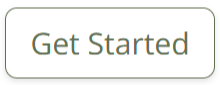

# Typical User Flow for a Business User

## 1. Registration
a) Go to the [landing page](https://mm-business-portal-deed0db15d35.herokuapp.com/).

b) Click the "Get Started" button, or in the menu click "Sign Up", to create an account.

c) Complete the registration form:
- Starred fields (*) are mandatory.
- Please use a valid email address as a confirmation email will be sent.
- Choose a username - you will use this to sign in. It must be at least 5 characters long and contain only letters, numbers, dots, or underscores. Dynamic help text is provided.
- For the question "Do you own or manage a business?" select 'yes'.
- For the question "Do you use a wheeled mobility device?" select 'no'.

d) Click the "Sign Up" button to submit the form.

e) If the form is invalid, error messages are displayed at the top of the form.

f) A confirmation email will be sent to the provided email address, click the link to verify the email.

g) After successful registration are redirected to the Verify Email page with a message to check your email for the confirmation link.

h) After clicking the link in the email, you are automatically signed in and redirected to your Personal Dashboard with a success message confirming that your email has been verified.

## 2. Sign In

a) If you are not already signed in, please sign in using your username or email, and password.

b) If you forget your password, you can use the "Forgot Password" feature to reset it via email.

c) Upon login, you are redirected to the business dashboard where you are invited to register your business. Click the "Register Business" button to proceed.

## 3. Register a Business

a) After signing in, you are invited to register your business. Click the "Register Business" button to proceed.

b) You are taken to the business registration form.

c) Fill out the business registration form. Fields with asterisks (*) are mandatory.

d) Click the Register button to submit the form.

e) If the form is invalid, error messages are displayed at the top of the form.

f) If the form is valid:    
- If the free membership tier is selected, the business is created, and you are redirected to the business dashboard with a success message.  
- If a paid membership tier is selected (standard or premium), you are redirected to the checkout page to complete the payment. The business is created but remains in the free tier until payment is completed.

## 4. Checkout & Membership Payment

a) If a paid membership tier is selected (standard or premium), you are directed to the checkout page.

b) The purchase summary confirms that you are purchasing the selected membership tier. You have the option to change the tier before proceeding with payment.

c) Enter your payment information and click the Complete Payment button to complete the purchase. A message is shown above the 'Complete Payment' button confirming how much you will be charged for the membership.

d) A spinner is shown on a semi-transparent overlay while the payment is processed, indicating that the payment is being processed, and preventing user interaction with the page.

e) If the payment fails, an error message is displayed, and you can retry the payment.

f) Upon successful payment, you are redirected to a Payment Success page confirming that your payment has been received. You are also sent a confirmation email. The business is upgraded to the selected tier.

g) You are redirected to the business dashboard with a success message confirming the membership purchase.

h) If payment is not completed, the business remains in the free tier, and you can upgrade later from the dashboard.

## 5. Business Dashboard

a) Looking at the dashboard, see that you can:
  - View and edit business details
  - See your membership tier and click a button to view the benefits
  - Click a button to view membership upgrade options if you are on the free or standard tier
  - Request Wheeler accessibility verification
  - View Wheeler accessibility verifications reports
  - Delete the business

b) Try editing the business details by clicking the "Edit Business" button at the bottom of the dashboard.

c) You are taken to the business edit form.

## 6. Edit Business Details

a) Update any business details as needed. The form is similar to the registration form but pre-filled with existing data.

b) The business logo is displayed in the form, and you can either remove or change it (or leave it as is).

c) Click the "Save Changes" button to submit the form. (You can also cancel to return to the dashboard without saving changes, or delete the business using the "Delete Business" button. A confirmation modal appears to confirm deletion.)

d) If the form is invalid, error messages are displayed at the top of the form.

e) If the form is valid, the business details are updated, and you are redirected back to the business dashboard with a success message.

## 7. Explore Plans & Upgrade Membership

a) Back on the Business Dashboard: if you are on the free or standard tier, click the "Explore Plans" button on the dashboard.

b) You can also access the Membership Options page from the dashboard by clicking "View Current Membership" and then "Upgrade Membership."

c) Review the available membership tiers (Standard and/or Premium) and their benefits.

d) Click the "Upgrade to <desired tier>" button for the desired tier.

e) You will be taken to the checkout page.

## 8. Request Wheeler Verification

a) From the Business Dashboard: request a Wheeler to verify your business's accessibility features by clicking the "Request Verification" button on the dashboard.

b) You are taken to the Wheeler Verification request page.

c) The page explains the verification process and any associated costs (if applicable). Note that the verification is free for Premium members, £30 for Standard members, and £60 Free members. 

d) Click the "Request Verification" button to submit the request.

e) For Free and Standard members, you are taken to the checkout page to complete the payment. Premium members skip this step and are taken directly to the dashboard with a success message.

f) On the checkout page, the purchase summary confirms that you are purchasing Wheeler verification of your business accessibility features. Your tier is also displayed together with the associated cost.

g) Ensure the payment details are correct

h) Enter your payment information and click the Complete Payment button to complete the purchase. A message is shown above the 'Complete Payment' button confirming how much you will be charged for the verification.

i) A spinner is shown on a semi-transparent overlay while the payment is processed, indicating that the payment is being processed, and preventing user interaction with the page.

j) Upon successful payment, you are redirected to a Payment Success page confirming that your payment has been received. You are also sent a confirmation email.

h) In the Accessibility Verification section of your Business Dashboard (bottom), you can see a Verification Requested badge indicating that the request is being processed.

## 9. Verification Process

The verification process is explained below in the [Typical User Flow for a Wheeler](./USERFLOW.md#typical-user-flow-for-a-wheeler).

Once a Wheeler has verified your business's accessibility features, you will receive an email notification, and you will see the verification report listed in the Accessibility Verification section of your Business Dashboard. When you have revceived three verified reports, you will be awarded a Verified badge that is displayed on your business listing in the search results, and on your business dashboard.

# Typical User Flow for a Wheeler

## 1. Registration and Sign In
Follow the same steps as for a Business user, but select 'yes' for the question "Do you use a wheeled mobility device?" during registration.
When you sign in, you are redirected to the Personal Dashboard.

## 2. Personal Dashboard

a) The Personal Dashboard displays your profile information, including your name, username, email, county, mobility device(s), and profile photo.

b) Under Account Actions, there are buttons to edit your profile, and change your password.

c) At the bottom of the dashboard, there is a section about Wheeler Accessibility Verification, which explains the process and includes a button to take you to the Accessible Business Search page.

d) First, try editing the profile information by clicking the "Edit Profile" button.

e) You are taken to the Edit Profile form.

## 3. Edit Profile

a) Update any details as needed. The form is similar to the sign up form but pre-filled with existing data.

b) Your profile photo is displayed in the form, and you can either remove or change it (or leave it as is).

c) Click the "Save Changes" button to submit the form. (You can also cancel to return to the dashboard without saving changes)

d) If the form is invalid, error messages are displayed at the top of the form.

e) If the form is valid, your profile details are updated, and you are redirected back to the personal dashboard with a success message.

## 4. Search for Accessible Businesses
a) In the Personal Dashboard, click the "Find Accessible Businesses" button to go to the Accessible Business Search page. You can also navigate to this page from the main menu.

b) If you are on a desktop or tablet device, a map is displayed on the left side of the screen, and the search results are displayed on the right side. On mobile devices, only the map is shown initially. 

c) On desktop, on initial load, all businesses are shown in the results list and on the map. In the list, businesses are always sorted by tier (Premium, Standard, Free), but randomised within each tier.

d) At the top (left) of the search page on a mobile (desktop), there is a search bar where you can enter keywords to search for businesses. This allows searching by business name, category, or tags [see the business category fixtures](/businesses/fixtures/business_categories.json) for examples of categories and tags.

e) Try typing 'food' in the search bar. On desktop, the results update automatically as you type. On mobile, you need to click the search button (magnifying glass icon) to run the search.

f) On mobile (desktop), the results list (updates to) shows businesses matching the search term. The map also updates to show only the markers for the matching businesses.

g) On mobile, you can toggle between the map view and the results list view using the buttons below the search bar.

h) Clear the search term by clicking the "x" button in the search bar. The results reset to show all businesses.

i) Try filtering businesses by location by zooming and/or panning the map. On mobile, you will need to switch to map view first. The results list updates to show only businesses within the current map bounds.

j) Now try filtering businesses by accessibility features using the dropdowns above the results list. Tap or click in the dropdown, and scroll down to see the available options. You can select multiple features. The results list updates to show only businesses matching the selected features. Try selecting 'Ramp' for example.

k) You can clear all selected features by clicking the X button, or remove individual features by clicking the small "x" next to each selected feature.

l) You can combine search terms, map bounds, and accessibility features to narrow down the results.

m) The results list shows each business's name, categories, address, and a badge if their accessibility features have been verified by wheelers. Businesses that have requested verification show a badge that can be clicked by wheelers to apply to verify their features. This is something we will try out in a later step.

n) Now try clicking on a business in the results list. The business accordion expands to show full details, including accessibility features, website, phone number, and opening hours. Businesses on paid membership plans can also display additional information such as description, services, special offers, social media links, and a logo. Note that when the accordion is open, the corresponding marker on the map turns orange on desktop screens.

o) Next, try clicking on a business marker on the map. A popup appears showing the business name, categories, address, and accessibility badges. On mobile, there is also a "Show more info" link that you can click to see the full business details in an overlay.

## 5. Apply to Verify a Business

a) In the search results list, find a business that has requested verification (look for the green badge, shown below, in the results list or popup). Click the badge to apply to verify their accessibility features. You are taken to the Accessibility Verification page for that business.

b) On the Accessibility Verification page, review the business details and accessibility features. Click Confirm Application to submit your application to verify the business.

c) You are redirected to an Application Submitted page confirming that your application has been received. You will be notified by email if your application is approved.

## 6. Accessibility Verification Hub

a) Click the "Go to the Accessibility Verification Hub" button to go to the Verification Hub.

b) In the Accessibility Verification Hub, you can see your current and past verification applications, their status, and action buttons. You may need to scroll to the right to see all columns.

c) You can also see businesses you have applied to verify and approved to verify on your personal dashboard. Apply to verify a couple more businesses in the business search page to see them listed there, and check back at various times to see their status.

d) In the Verification Hub, and on your personal dashboard, you can link to the full details of the business you applied to verify. In the Verification Hub, click the business name to open the business details in a new tab. On your personal dashboard, click the "View Business" button next to the business you applied to verify.

## 7. Applicaition Approval

a) If you are testing this platform as a Code Institute assessor, please approve your application now before proceeding to the next step. If you are testing as a regular user, you will need to wait for an admin to approve your applications. Log into Django admin with the superuser account provided, then click on "Wheeler werifications applications" in the sidebar. Find the business you applied to in the list, click it to open the detail view, then check the "Approved" box and save.

b) Once your application is approved, you will receive an email notification. You can then refresh the Accessibility Verification Hub to see your approved application. Click the green "Submit Verification" button to proceed to the verification form. We ask that wheelers complete the form while at the business premises.

## 8. Complete the Verification Form

a) On the Verification Form page, check you are at the right address and business. Complete the form by selecting the accessibility features you observed, and upload a photo for each one you ticked.

b) Then look to see if there are any additional features you observed that are not listed. If so, check them and upload a photo for each one.

c) Select the mobility device you are currently using at the premises.

d) Take a selfie photo at the business premises and upload it. This is to verify that you visited the business.

e) Upload any additional photos you took that may be helpful for your report. You can upload multiple photos at once by selecting multiple files in the file dialog by holding down Ctrl (Windows) or Command (Mac) while selecting files.

f) Finally, write a brief report of your visit in the text area provided.

g) Click the "Submit Verification" button to submit the form.

h) If the form is invalid, error messages are displayed next to the relevant fields or at the top of the form.

i) If the form is valid, you are redirected to your personal dashboard. A success message is displayed, and you are sent a confirmation email.

## 9. View Verification Report

a) You can view your submitted verification in the Verification Hub. The status will be "Submitted" until an admin reviews and approves it. If you are testing this platform as a Code Institute assessor, please approve your submitted verification now before proceeding to the next step. If you are testing as a regular user, you will need to wait for an admin to approve your submission. Log into Django admin with the superuser account provided, then click on "Wheeler verifications" in the sidebar. Find your submitted verification in the list, click it to open the detail view, then check the "Approved" box and save.

b) Once your verification is approved, you will receive an email notification. You can then refresh the Accessibility Verification Hub to see your approved verification.

c) View your report from the Verification Hub by clicking "View Report" next to the relevant business.